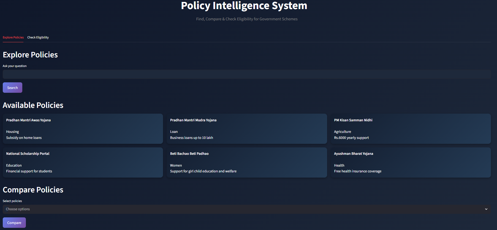
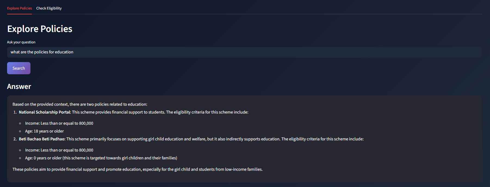
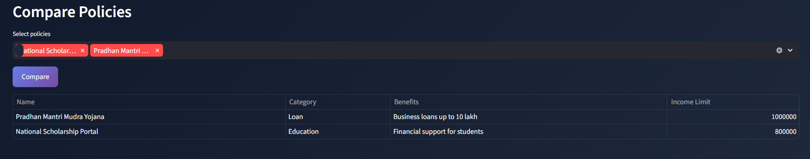
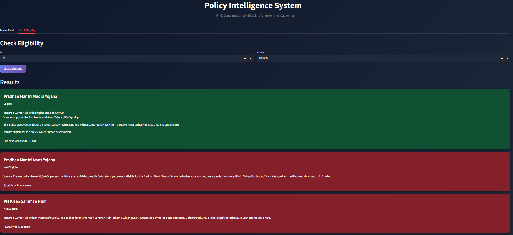

# Policy Intelligence System

An AI-powered system for analyzing and retrieving government policies using Retrieval-Augmented Generation (RAG).  
Enables users to query policy documents and receive context-aware, accurate responses.

##  Live Demo
[Live Demo](https://governmentintelligencesystem-edud4yffz7qfkb937gd425.streamlit.app/)

## Problem Statement

Government policies are often lengthy, complex, and difficult to navigate.  
This system simplifies access by enabling users to ask natural language questions and retrieve relevant policy information instantly.

##  Features

-  Semantic search using embeddings
-  Context-aware question answering using LLMs
-  Faster and more relevant results than keyword-based search
-  Interactive UI built with Streamlit

##  Tech Stack

- **Language:** Python  
- **Frameworks:** LangChain  
- **Vector DB:** FAISS  
- **LLMs:** Groq API  
- **Libraries:** Hugging Face Transformers, PyPDF  
- **Frontend:** Streamlit  

##  System Architecture

1. Load structured policy data from JSON files  
2. Parse and normalize fields (name, eligibility, benefits, etc.)  
3. Convert relevant fields into text representations  
4. Generate embeddings for each policy entry  
5. Store embeddings in FAISS vector database  
6. Retrieve relevant policies based on user query  
7. Generate final response using LLM with retrieved context  

##  Project Highlights

- Built modular pipeline for ingestion, retrieval, and response generation
- Improved retrieval relevance compared to keyword-based search
- Tested across diverse user queries

## Future Improvements
Add multi-language support
Improve UI/UX design
Integrate real-time policy updates
Add policy comparison and filtering features
